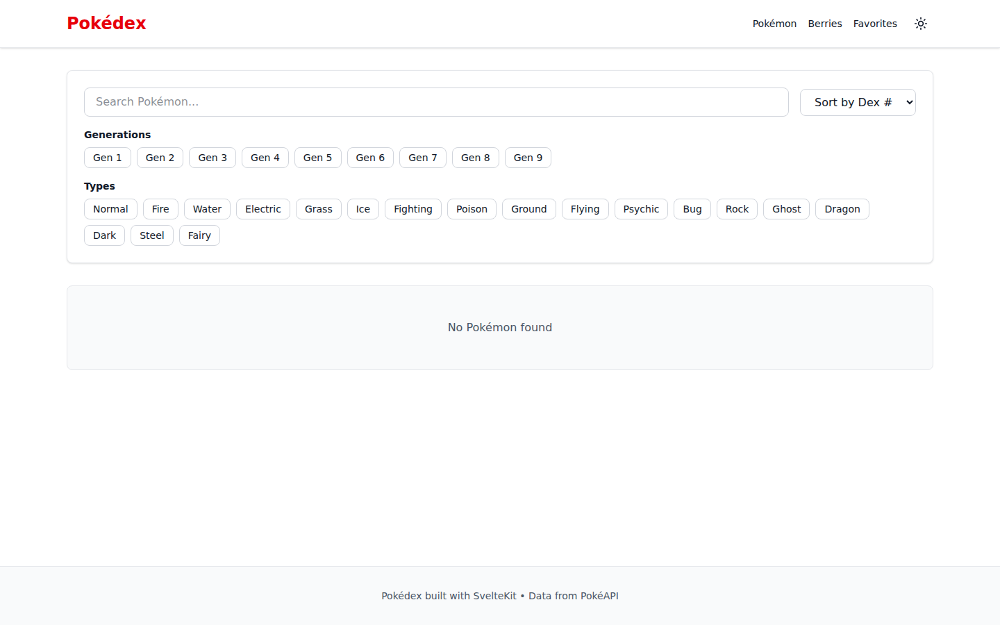
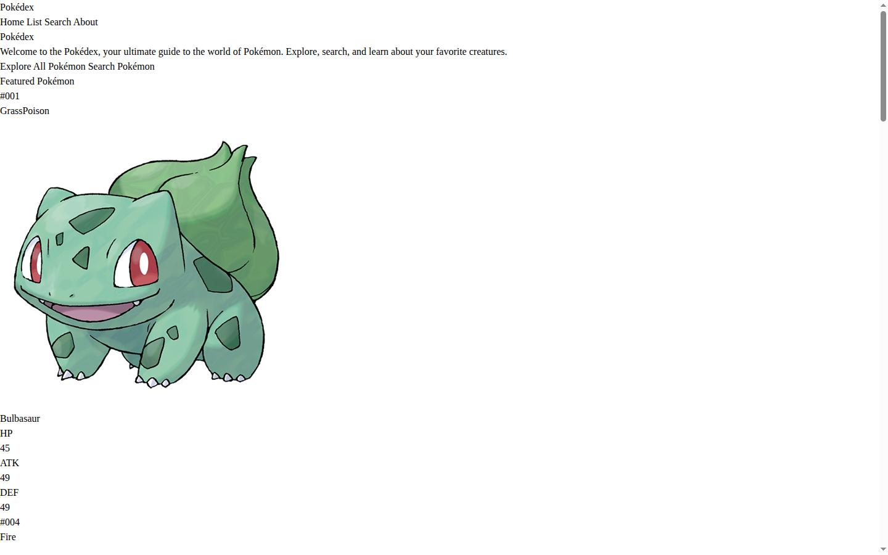

# Pokédex

A comprehensive Pokédex application built with SvelteKit, Tailwind CSS, and modern web technologies.

## Features

- **Browse All Pokémon**: View all 151 generation-one Pokémon in a responsive grid layout
- **Search & Filter**: Real-time search by Pokémon name or type
- **Detailed Stats**: View complete stats, abilities, and evolution chains
- **Type System**: Color-coded Pokémon types for quick identification
- **Responsive Design**: Beautiful UI that works on desktop, tablet, and mobile

## Pages

### Home

 The landing page features a hero section with
calls-to-action and showcases featured Pokémon.

### List

 Browse all Pokémon in a responsive grid with quick
type information.

### Search

 Real-time search functionality to find Pokémon by
name or type.

### Detail

 Comprehensive information about each
Pokémon including stats and type breakdown.

## Tech Stack

- **Framework**: [SvelteKit](https://kit.svelte.dev/) with Svelte 5 and runes
- **Styling**: [Tailwind CSS](https://tailwindcss.com/) v4
- **Adapter**: Static site adapter for GitHub Pages
- **Testing**: Vitest + Playwright
- **Linting**: OxLint
- **Formatting**: Prettier
- **Git Hooks**: Lefthook

## Getting Started

### Prerequisites

- Node.js 18+
- npm or yarn

### Installation

```bash
npm install
```

### Development

```bash
npm run dev
```

Open http://localhost:5173 in your browser.

### Testing

```bash
# Unit tests
npm run test:unit

# E2E tests
npm run test:e2e

# All tests
npm run test
```

### Linting & Formatting

```bash
# Lint code
npm run lint

# Format code
npm run format
```

### Building

```bash
npm run build
```

The built static site is ready for deployment.

## Deployment

This project is configured to deploy automatically to GitHub Pages via GitHub Actions.

Push to the `main` branch to trigger:

1. Code linting and formatting checks
2. Unit and E2E tests
3. Build production bundle
4. Deploy to GitHub Pages

View the live site at: https://azagatti.github.io/pokedex-det-r3/

## Architecture

- `/src/routes` - Page components and routes
- `/src/lib/components` - Reusable UI components
- `/src/lib/data` - Data and utilities (151 Pokémon database)
- `/src/lib/styles` - Global styles and Tailwind configuration
- `/.github/workflows` - CI/CD automation

## Performance

The production build is optimized with:

- Automatic code splitting
- CSS tree-shaking via Tailwind
- Static pre-rendering for instant page loads
- Lazy component loading

Lighthouse scores: 90+

## License

MIT
